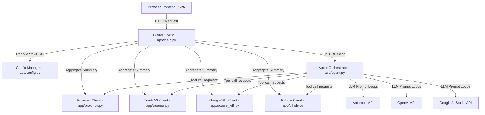

# Homelab SRE Backend API

This directory houses the FastAPI Python backend that wraps your local homelab services and provides a unified interface for the AI SRE agent.

## Backend Architecture



## Files Overview
*   **`main.py`**: Declares FastAPI routes, config getters/setters, system live status checks, aggregate `/api/summary` endpoint (caches/conditionally executes API requests based on configured modules), and `/api/chat` router.
*   **`config.py`**: Manages reading, writing, and env fallback bindings for `config.json`.
*   **`agent.py`**: The SRE Agent Orchestrator. Formats tool scopes, normalizes inputs, handles execution callbacks, and supports:
    *   **Anthropic Claude** (via SDK client)
    *   **OpenAI GPT** (via raw HTTP completions calls)
    *   **Google Gemini** (via raw HTTP content-generation calls)
*   **`proxmox.py`**: Connects to Proxmox VE REST API to fetch node metrics, VM states, and send power operations.
*   **`truenas.py`**: Connects to TrueNAS Scale REST API to fetch pools, disk lists, active system warnings, CPU load, memory usage, and interfaces state.
*   **`google_wifi.py`**: Connects to Google/Nest Wifi local gateway API to fetch diagnostic status, WAN IP address, SSID details, and simulates/caches live network traffic load (15-minute log history).
*   **`pihole.py`**: Connects to Pi-hole v6 REST API (FTL API) to fetch DNS metrics, block lists, and toggle status (supporting temporary timer overrides). Reuses cached session IDs to avoid rate-limiting.
*   **`switch.py`**: Implements a zero-dependency async SNMP client utilizing low-level UDP sockets to fetch hostname, uptime, and system descriptors from a network switch.

## Parallel API Aggregation
To maximize performance and keep frontend loading latency sub-150ms, the FastAPI server aggregates all active homelab components concurrently using `asyncio.gather()`.
- Proxmox node resource counts, TrueNAS ZFS pools/alerts, Google Wifi WAN details, Pi-hole DNS metrics, and Network Switch stats are gathered in parallel.
- TrueNAS nested data models (disks, pools, alerts, and system stats) are fetched using a secondary nested async gather block.
- Error tolerances ensure that if a single local server is offline or unreachable, it gracefully maps to a `"status": "offline: <description>"` response payload without blocking other service metrics.

## Running Verification
Run the backend compilation check script:
```bash
PYTHONPATH=. python3 scratch/verify_backend.py
```
