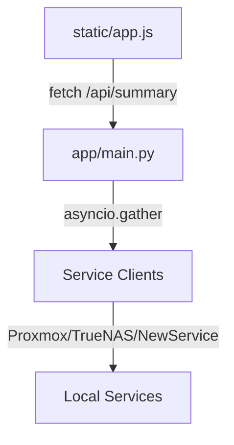

# Developer Guide: Building Homelab Dashboard Modules

This guide outlines the step-by-step process for adding a new module (monitoring card & connection setting) to the Homelab SRE Console. It is designed to be easily read and executed by both human developers and autonomous AI coding agents.

---

## Architecture Overview

A module consists of:
1. **API Client (`app/new_service.py`)**: Fetches data from the third-party service.
2. **Configuration (`app/config.py`)**: Stores credentials and active states.
3. **Backend aggregator (`app/main.py`)**: Handles parallel async data fetching.
4. **Agent Integration (`app/agent.py`)**: Exposes tool actions to the AI SRE.
5. **Frontend UI Layout (`static/index.html` & `static/app.js`)**: Grid cards, configuration checkboxes, status indicators, and hover dropdowns.



---

## Step 1: Create the API Client
Create a new file `app/new_service.py`. It must:
- Use `httpx.AsyncClient` with a reasonable timeout (e.g. 5.0 seconds).
- Use SSL bypassing (`verify=False`) for internal deployment self-signed certificates, if relevant.
- Return a standard dictionary format with clear status metrics.
- Handle exceptions gracefully, returning `"status": "offline: <error>"` instead of crashing.

### Template: `app/new_service.py`
```python
import httpx
import logging
from typing import Dict, Any, List, Optional
from app.config import config

logger = logging.getLogger(__name__)

class NewServiceClient:
    def __init__(self):
        self.default_host = "192.168.1.100"

    async def _request(self, method: str, path: str, json_data: Any = None) -> Any:
        host = config.new_service_host or self.default_host
        api_key = config.new_service_api_key
        if not api_key:
            raise ValueError("NewService API key is not configured.")

        url = f"http://{host}/api{path}"
        headers = {
            "Authorization": f"Bearer {api_key}",
            "Accept": "application/json"
        }
        
        async with httpx.AsyncClient(timeout=5.0) as client:
            try:
                response = await client.request(method, url, headers=headers, json=json_data)
                response.raise_for_status()
                return response.json()
            except Exception as e:
                logger.error(f"NewService request failed: {e}")
                raise RuntimeError(f"Connection failed: {str(e)}")

    async def test_connection(self) -> Dict[str, Any]:
        try:
            data = await self._request("GET", "/ping")
            return {"status": "connected", "version": data.get("version", "unknown")}
        except Exception as e:
            return {"status": "disconnected", "error": str(e)}

    async def get_summary_stats(self) -> Dict[str, Any]:
        # Fetch status/metrics
        return await self._request("GET", "/stats")

new_service_client = NewServiceClient()
```

---

## Step 2: Register Configurations
Modify `app/config.py`:
1. Add variables to `Config` class properties (e.g., `new_service_host`, `new_service_api_key`).
2. Add module visibility flag to the `active_modules` dictionary property:
   ```python
   # Inside active_modules getter:
   defaults = {
       "proxmox": True,
       ...
       "new_service": True
   }
   ```
3. Update `is_configured()` logic if the module requires mandatory credentials.

---

## Step 3: Integrate with Backend aggregator
Modify `app/main.py`:
1. Import the client instance:
   ```python
   from app.new_service import new_service_client
   ```
2. Modify `/api/config` routes (GET/POST) to read, check existence, and save the new credentials.
3. Update `/api/status` test checks.
4. Modify `/api/summary` to query the service concurrently:
   ```python
   # Inside get_system_summary():
   # 1. Instantiate placeholder
   summary["new_service"] = {"status": "unknown"}

   # 2. Append Task
   if active.get("new_service"):
       async def fetch_new_service():
           try:
               stats = await new_service_client.get_summary_stats()
               return {
                   "status": "online",
                   "metrics": stats.get("value"),
                   # Add other mapping fields
               }
           except Exception as e:
               logger.error(f"Failed to fetch stats: {e}")
               return {"status": f"offline: {str(e)}"}
       tasks.append(("new_service", fetch_new_service()))
   else:
       summary["new_service"] = {"status": "disabled"}
   ```

---

## Step 4: Add Frontend UI Layout
Modify `static/index.html`:

### 1. Toggle Checkbox (Settings modal - Left pane)
```html
<label class="settings-checkbox-container">
    <input type="checkbox" id="module-new-service" checked>
    <span>New Service Monitor</span>
</label>
```

### 2. Credentials input (Settings modal - Right pane)
```html
<div class="form-group">
    <label for="input-new-service-host">NewService Host IP/Domain</label>
    <input type="text" id="input-new-service-host" placeholder="192.168.1.100">
</div>
<div class="form-group">
    <label for="input-new-service-key">NewService API Key</label>
    <input type="password" id="input-new-service-key" placeholder="Enter API Key">
</div>
```

### 3. Grid Card Container
Add the card inside the `<div class="dashboard-grid">`:
```html
<div class="dashboard-card card-new-service">
    <div class="card-header">
        <div class="card-title">
            <span class="card-icon">⚡</span>
            <span>New Service</span>
        </div>
        <span class="card-badge badge-ok">online</span>
    </div>
    <div class="card-body">
        <div class="metrics-grid" id="new-service-metrics">
            <div class="metric-item">
                <span class="metric-label">Status</span>
                <span class="metric-value">Loading...</span>
            </div>
        </div>
    </div>
</div>
```

### 4. Connection Status Badge & Dropdown
Add the status bar element under `<div class="status-list">`:
```html
<div class="status-item clickable" id="status-new-service">
    <span class="status-indicator warning"></span>
    <span class="status-label">New Service:</span>
    <span class="status-value">Checking...</span>
</div>
<div class="status-dropdown" id="dropdown-new-service">
    <div class="dropdown-content">Loading...</div>
</div>
```

---

## Step 5: Implement Javascript Data Bindings
Modify `static/app.js`:

### 1. DOM selectors
Declare elements at the top:
```javascript
const statusNewService = document.getElementById("status-new-service");
const dropdownNewService = document.getElementById("dropdown-new-service");
```

### 2. Config Modal Save/Restore
- In `openConfigModal()`: Restore checkbox states and input values from localStorage/backend data.
- In `saveConfiguration()`: Retrieve checkbox states and input strings, then POST to `/api/config`.

### 3. Render Card & Grid Visibility
Inside `updateDashboard()`:
- Display/hide card based on module toggle state:
  ```javascript
  const cardNew = document.querySelector(".card-new-service");
  if (cardNew) cardNew.style.display = active.new_service ? "flex" : "none";
  ```
- Invoke the rendering helper if enabled:
  ```javascript
  if (active.new_service) renderNewService(data.new_service);
  ```

### 4. Render Helper Template
```javascript
function renderNewService(serviceData) {
    const container = document.getElementById("new-service-metrics");
    const badge = document.querySelector(".card-new-service .card-badge");
    
    if (serviceData.status.startsWith("offline")) {
        badge.className = "card-badge badge-error";
        badge.textContent = "offline";
        container.innerHTML = `<div class="status-error">Error: ${serviceData.status}</div>`;
        return;
    }
    
    badge.className = "card-badge badge-ok";
    badge.textContent = "online";
    
    container.innerHTML = `
        <div class="metric-item">
            <span class="metric-label">Core Performance</span>
            <span class="metric-value">${serviceData.metrics || 0}</span>
        </div>
    `;
}
```

### 5. Status Indicators & Hover dropdowns
- In `updateStatusIndicators(data, hasClaudeKey)`:
  ```javascript
  const newActive = data.new_service && data.new_service.status !== "disabled";
  statusNewService.style.display = newActive ? "flex" : "none";
  if (newActive) {
      const isOnline = data.new_service.status === "online";
      updateStatusItem(statusNewService, isOnline, isOnline ? "ONLINE" : "OFFLINE");
  }
  ```
- In `populateDropdowns(data)`:
  ```javascript
  if (data.new_service && data.new_service.status !== "disabled") {
      const drop = document.getElementById("dropdown-new-service");
      if (drop) {
          drop.innerHTML = `
              <div class="dropdown-content">
                  <div class="dropdown-row"><span>Status:</span><span>${data.new_service.status}</span></div>
              </div>
          `;
      }
  }
  ```

---

## Step 6: Expose Tools to the SRE Agent
Modify `app/agent.py`:
1. Add a tool declaration in `TOOLS` (e.g. `get_new_service_status`).
2. Add tool mappings in `execute_tool()` to map name to `new_service_client` async methods.

---

## Verification Checklist for AI Agent
Before completing the module refactor:
- [ ] Run compiler check: `PYTHONPATH=. venv/bin/python scratch/verify_backend.py` to ensure imports match.
- [ ] Verify HTML selectors match DOM ID/Class declarations exactly.
- [ ] Verify that disabling the module from settings skips backend API fetches.
- [ ] Verify exception safety (timeout or network crashes must show up as "offline: description" and not crash the aggregator API).

---

## Reference Implementations
If you are building a custom module that integrates a low-level network protocol (e.g. SNMP, Modbus, syslog) and want to avoid third-party pip dependencies, review:
- **[app/switch.py](file:///usr/local/google/home/amarcum/sre-ai/app/switch.py)**: Implements an async SNMP UDP client using `asyncio.DatagramProtocol` with custom BER message encoders/decoders.
- **[static/app.js](file:///usr/local/google/home/amarcum/sre-ai/static/app.js#L1008-L1064)**: Implements dynamic 8-port Ethernet widgets containing inline real-time SVG sparklines (`drawMiniSparkline`).

